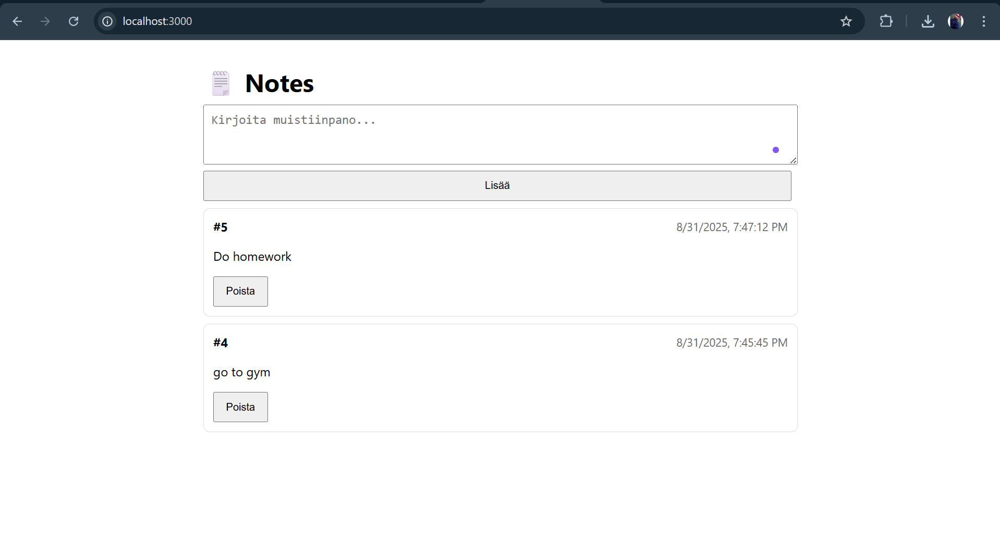

Tässä valmis **README.md** – kopioi sellaisenaan projektiin.

```markdown
# 🗒️ Notes App (Docker) – Simppeli ilman SQL:ää

Yksinkertainen muistiinpanosovellus, joka ajetaan **Docker**-kontissa.  
Data säilyy **vain muistissa** (ei tietokantaa / ei tiedostotallennusta). Mukana kevyt selain-UI.

---

```
## 📁 Projektirakenne
```

my-notes-app/
├─ package.json
├─ index.js
├─ Dockerfile
├─ docker-compose.yml
└─ public/
└─ index.html
```

```

> Huom: `docker-compose.yml` **ei** sisällä `version:`-riviä (se on vanhentunut).

---

## 📦 Vaatimukset

- Docker Desktop (Windows/Mac) tai Docker Engine + Docker Compose
- Vapaa portti **3000**

---

```

## 🚀 Käynnistys Dockerilla

Projektikansiossa:

```bash

docker compose build
docker compose up

```


Avaa selaimessa:
👉 [http://localhost:3000](http://localhost:3000)

Pysäytys: `Ctrl + C`
Siivous:

```bash
docker compose down
```

---

## 🔧 Kehitys (automaattinen uudelleenkäynnistys)

`docker-compose.yml` käyttää **volyymia** ja ajaa `npm run dev` (**nodemon**).
Kun muokkaat koodia hostilla, kontti käynnistyy automaattisesti uudelleen.

Jos muutit **package.json** (riippuvuudet tms.), tee rebuild:

```bash
docker compose down
docker compose build
docker compose up
```

---

## 🌐 Sovelluksen käyttö

* Etusivu: `http://localhost:3000`

  * Kirjoita teksti → **Lisää**
  * Poista napista **Poista**

---

## 🔌 API-rajapinta

* `GET /api/notes` → Palauttaa kaikki muistiinpanot (JSON)
* `POST /api/notes` → Luo muistiinpanon
  **Body (JSON):**

  ```json
  { "text": "oma teksti" }
  ```
* `DELETE /api/notes/:id` → Poistaa muistiinpanon id\:n perusteella

### 🧪 Nopea testaus cURL\:lla

```bash
# Hae kaikki
curl http://localhost:3000/api/notes

# Luo uusi
curl -X POST http://localhost:3000/api/notes \
  -H "Content-Type: application/json" \
  -d "{\"text\":\"Moikka Docker 🌊\"}"

# Poista (esim. id=1)
curl -X DELETE http://localhost:3000/api/notes/1
```

---

## ❗ Vianetsintä

* **Portti 3000 varattu**
  Muuta porttikartoitusta `docker-compose.yml`:

  ```yaml

  ports:
    - "3001:3000"

  ```

  Tällöin avaa: `http://localhost:3000`.

* **Koodi ei päivity**
  `nodemon` käynnistää automaattisesti. Jos ei, pysäytä ja aja `docker compose up` uudelleen.
  Windowsissa auttaa joskus:

  ```bash

  docker compose down
  docker compose up --build

  ```

* **“nodemon not found”**
  Tee rebuild (riippuvuudet asennetaan buildissä):

  ```bash

  docker compose down
  docker compose build
  docker compose up

  ```

---

## 🧰 Aja ilman Dockeria (valinnainen)

```bash
npm install
npm run dev
# selain: http://localhost:3000
```

---

## 📌 Huomio datasta

Tämä versio **ei tallenna pysyvästi** (muisti tyhjenee, kun kontti käynnistyy uudelleen).
Laajennukset (myöhemmin):

* Tiedostopohjainen tallennus (`notes.json` + Docker-volume)
* MariaDB/MySQL (Sequelize)

---

## 🖼️ Kuvakaappaukset (palautusta varten)

Voit lisätä README\:hen esim.:





Onnea matkaan! 💪

```
```
